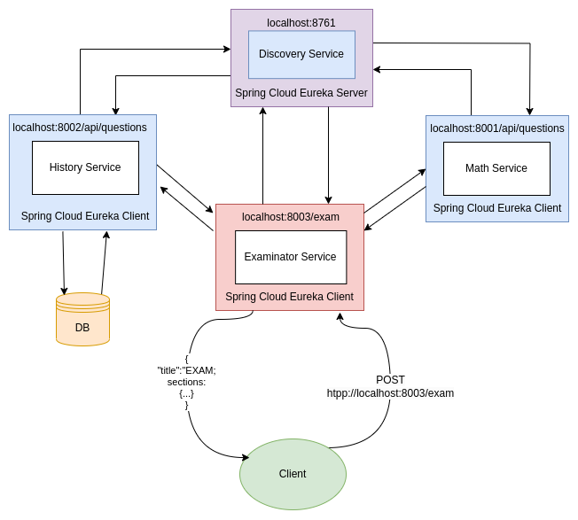

# EXAMINATOR

[](https://github.com/elseff/examinator/actions)


    
    Приложение позволяет получить список вопросов для экзамена по указанным темам.
    
<b>Технологии и языки:</b>
1. Java 17
2. Spring (Boot, Data JPA, Web, Cloud, Actuator)
3. PostgreSQL
4. Flyway
5. Maven
6. Docker

### Запуск
#### Запуск с помощью docker-compose
Вы можете запустить приложение через docker-compose

```
    cd ./scripts/layered
    ./build-leayered.sh
    docker-compose up
```

<hr/>